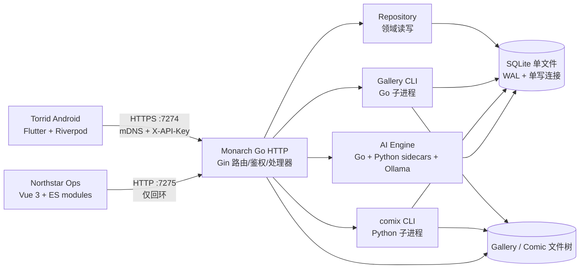
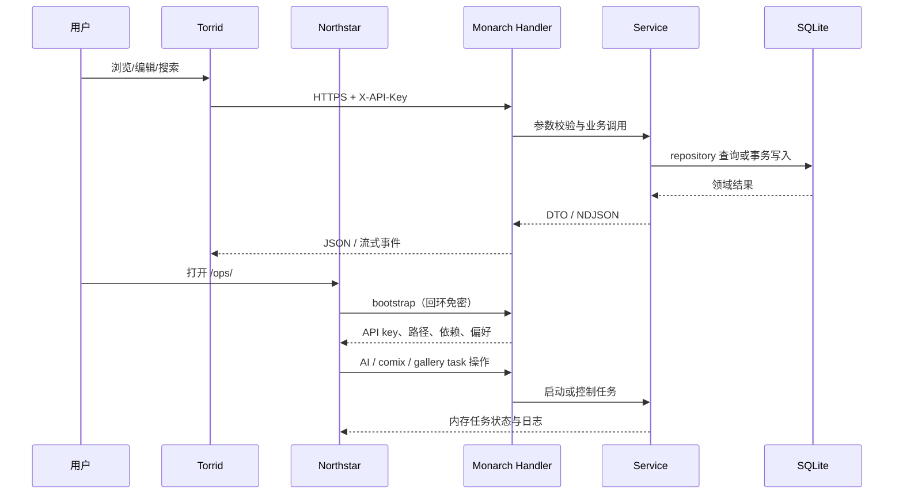

# Ronin 三端架构地图

> 本文档按当前代码整理，目标是帮助继续维护和改动，而不是替代代码注释。
> 生成的路由快照、数据库说明和各端 `AGENTS.md` 是本文档的交叉索引；真实行为仍以 Go/Dart/JavaScript 源码为准。

## 1. 一句话模型

Ronin 是一个**本机优先的媒体与个人数据系统**：

- **Monarch**（Go）是唯一的后端真源，负责 HTTP API、SQLite、媒体库、AI 编排和外部 CLI 生命周期。
- **Torrid**（Flutter/Android）是个人消费端：用户数据与对话以本地体验为中心，媒体标签等权威写入服务端。
- **Northstar**（Vue 3 + 原生 ES 模块）是本机运维端：只在回环地址使用，负责任务、AI、漫画和服务状态管理。

## 2. 运行时边界

| 边界 | 约定 |
| --- | --- |
| 局域网消费 | `LOCAL_PORT`（默认 7274）HTTPS，自签证书，Monarch 通过 mDNS 广播 |
| 本机运维 | `LOCAL_HTTP_PORT`（默认 7275）HTTP；`/ops/` 和 `/API/ops/local/*` 只接受回环 |
| 通用 API | 两个端口路由一致；非本机能力接口使用 `X-API-Key` |
| 静态资源 | `/static/` 映射 `STATIC_DIR`；媒体文件也通过 API 资源路由返回 |
| 状态持久化 | 业务状态在 SQLite；AI/CLI 任务运行态在内存，Monarch 重启后清空 |
| 文件状态 | Gallery/Comic 文件落盘，数据库主要保存相对路径和处理元数据 |

## 3. 按数据域看“谁是真源”

| 数据域 | 真源 | Android 本地 | Ops 本地 |
| --- | --- | --- | --- |
| 随笔/打卡 | Monarch SQLite 的 user-data 表 | Hive 工作副本，通过整体同步/备份 API 对齐 | 不操作 |
| Gallery 媒体、人工标签、标注 | Monarch SQLite + Gallery 文件树 | `gallery.db` 是缓存；写入走服务端，画廊页可离线缓冲 | 查询和运维 |
| AI 产物、任务、人物、去重否决 | Monarch AI 表与内存索引 | 查询/聊天/智能相册的消费端 | 主要控制面 |
| 漫画元数据与下载任务 | `comic_*` 表与 Comic 文件树 | 阅读、下载到设备、本地阅读状态 | 爬虫、库管理、追更 |
| Chat 会话与消息 | Android Hive（本地） | 唯一真源；服务端只负责本轮推理 | 不展示会话 |
| Review 预设 | 服务端 `review_presets.json` | Hive 镜像，支持离线读取 | 不直接编辑 |
| Ops 界面偏好 | 服务端 `ops_web.json` | 不涉及 | 页面只保留内存镜像 |

## 4. 一次典型请求的路径

## 5. 维护时先问的五个问题

1. **这个字段的权威在哪？** 是 SQLite、文件树、Android Hive，还是 Ops 偏好文件？
2. **这是同步请求还是长任务？** 长任务必须经过 `taskengine`，不能在 handler 中直接阻塞执行。
3. **写入是否需要事务？** 用户数据整体替换、标签树、AI 任务认领等必须走写连接/事务。
4. **是否改变 API 契约？** 先改 Go 真源，再运行 `references/scripts/generate_refs.ps1`，最后同步端上 DTO。
5. **是否改变跨端语义？** 尤其注意 `sync_count`、`edit_params`、NDJSON 事件和 AI 503 降级。

## 6. 文档导航

- [Monarch 后端架构](./monarch.md)：启动装配、路由、存储、AI、CLI 和鉴权。
- [Torrid Android 架构](./torrid.md)：Flutter 分层、网络真源、本地缓存和功能域。
- [Northstar 运维端架构](./northstar.md)：静态托管、hash 路由、页面状态和轮询。
- [维护流程与边界](./maintenance.md)：改动路径、契约同步、常见陷阱和验证命令。

## 7. 重要代码入口

- [Monarch 启动入口](../../backend/cmd/main.go)
- [Monarch 路由装配](../../backend/internal/router/router.go)
- [Torrid 入口](../../android/lib/main.dart)
- [Torrid 路由](../../android/lib/app/routes/routes.dart)
- [Northstar 入口](../../ops/web/src/main.js)
- [API 路由快照](../../backend/references/generated/api/routes.md)
