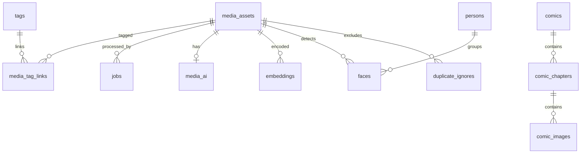

# Monarch 后端架构

## 1. 启动装配顺序

[cmd/main.go](../../backend/cmd/main.go) 是唯一启动入口，顺序体现了依赖关系：

1. `config.Load()` 读取 `.env` 和运行配置。
2. 创建并加载 `ai_config.json` 对应的 `ConfigStore`。
3. `db.Init()` 打开 SQLite，应用幂等 schema 和列迁移。
4. 创建并加载 `ops_web.json` 对应的 `OpsStore`，注入 Ops handler。
5. 创建 AI `Engine`，注入暂停状态存储并启动后台循环。
6. 启动 HTTP/HTTPS 双端口；退出时停止 AI、Gallery 和 comix 子进程。

这意味着 handler 不应自行创建数据库、配置或外部进程；这些资源由启动装配提供全局服务门面。

## 2. 请求层次

```text
Gin middleware
  ├─ CORS
  ├─ selectiveAuth()
  ├─ /static 与 /ops 静态托管
  └─ /API
      ├─ handler：HTTP 参数、状态码、响应 DTO
      ├─ service：任务、AI、媒体探测、review、外部进程
      ├─ repository：SQL、事务、领域查询
      └─ model：跨层数据结构
```

入口文件：

- [router.SetupRouter](../../backend/internal/router/router.go)：全部路由和 middleware。
- [http_server.StartServer](../../backend/internal/service/server/http_server.go)：双端口、证书、mDNS。
- [auth middleware](../../backend/internal/handler/util_handler/auth_middleware.go)：API key、回环豁免和失败封禁。

当前生成快照为 81 条路由，完整清单见 [routes.md](../../backend/references/generated/api/routes.md)。快照是导航工具，不是路由真源。

## 3. API 分区

| 路由组 | 主要消费者 | 责任 |
| --- | --- | --- |
| `/API/user-data` | Torrid | 随笔、打卡同步/备份/图片检查 |
| `/API/comic` | Torrid | 阅读侧漫画列表、章节、图片和设备下载 |
| `/API/gallery` | Torrid + Northstar | 媒体查询、标签、标注、批次缓存和文件 |
| `/API/ai` | Torrid + Northstar | AI 状态、队列、检索、人物、聊天、近期回顾 |
| `/API/comix` | Northstar | Python 爬虫配置、库、下载和任务生命周期 |
| `/API/ops/overview` | Northstar | 系统状态概览 |
| `/API/ops/local` | Northstar（仅回环） | bootstrap、偏好、资源管理器、Gallery CLI 任务 |

### 鉴权模型

- 通用接口需要 `X-API-Key`；图片等不能加 header 的资源允许 `api_key` 查询参数。
- `/API/comic`、`/API/test` 和 Ops 本机接口由选择性鉴权规则放行。
- Ops 本机接口并非“信任任意客户端”：`LocalOnly` 以 TCP 对端回环地址为边界。
- 非回环错误 API key 按 IP 计数并持久化封禁；回环地址永不封禁，避免 bootstrap/密钥轮换把本机锁死。

## 4. SQLite 设计

[db.Init](../../backend/internal/service/db/db.go) 建立两个连接池：

- 写连接池：最多一个连接，`_txlock=immediate`，WAL、foreign keys、busy timeout。
- 读连接池：可并发读取，WAL 下与写入互不阻塞。
- 写操作由 busy 重试包裹；跨进程写入还要考虑 comix/Gallery CLI。

数据域：



- `media_assets/tags/media_tag_links`：Gallery 主数据；人工标签和 AI 标签物理隔离。
- `essay_* / booklet_*`：用户数据整体替换同步。
- `media_ai / embeddings / faces / persons / jobs`：AI 产物与任务。
- `comic_*`：comix 自己维护，Monarch 通过 repository/handler 使用。

新增列不能只改 `CREATE TABLE IF NOT EXISTS`；同时更新 `sqlite.sql` 和
[migrate.go](../../backend/internal/service/db/migrate.go) 的 `addedColumns`。

## 5. 任务与外部进程

[taskengine.Manager](../../backend/internal/service/taskengine/engine.go) 是统一的子进程生命周期层：

- 异步启动、stdout/stderr 逐行日志、退出码和结构化结果。
- 任务状态只保留在内存，服务重启即清空。
- `Stop`/`KillAll` 负责杀进程树，避免 Python/CLI 孤儿进程。

两个消费者：

1. [Gallery service](../../backend/internal/service/gallery/cli.go)：`ingest`、`execute`、`refresh`；同一时间只允许一个任务，因为它们都可能改写媒体文件和数据库。
2. [comix service](../../backend/internal/service/comix/tasks.go)：调用 `python -m comix.cli --json`；stdout 是单行 JSON，进度主要来自 stderr。

comix 本身是无状态 CLI；数据库/文件协议见 [comix AGENTS](../../backend/gizmos/comix/AGENTS.md)。

## 6. AI 引擎

[ai.Engine](../../backend/internal/service/ai/engine.go) 是后台 AI 门面：

```text
reconcile：发现缺失/指纹变化 -> jobs 幂等入队
worker：事务认领 jobs -> 准备图源 -> 执行能力 -> 保存产物
sidecar：embed / face / ocr Python 进程，空闲回收
ollama：VLM 进程/服务监管，按需使用
index：int8 向量加载到 Go 内存做精确扫描
cluster：人脸在线归并与批量重聚类
```

### 关键不变量

- `phash/embed` 固定使用 preview 256；`face/ocr/vlm` 使用按需缓存的 AI 1024 图。
- `input_sig` 同时记录输入档位和执行者；变更模型/执行器后 reconcile 可重排，历史 NULL 不自动重排。
- 本机只有一个 GPU，模型仲裁器保证同一时间只运行一个模型；前台聊天可抢占后台标注。
- `AI_ENABLED=false` 或 AI schema 缺失时，主服务仍启动；端上应将 AI 失败降级而不是白屏。
- `/API/ai/chat` 和 `/API/ai/review` 是 NDJSON 流；先有状态/通知类事件，再有增量内容。

## 7. 修改后验证

```powershell
go build ./...
go vet ./...
go test ./...
powershell -ExecutionPolicy Bypass -File .\references\scripts\generate_refs.ps1
powershell -ExecutionPolicy Bypass -File .\references\scripts\generate_refs.ps1 -Check
```

如果改了路由或 CLI 参数，快照刷新是接口变更的一部分；客户端再按处理函数阅读实际响应结构。
