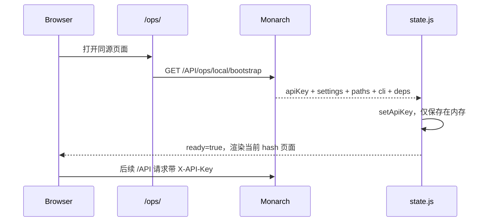

# Northstar 运维端架构

## 1. 它不是独立服务

Northstar 源码在 `ops/web/`，由 Monarch 的 [setupOpsWeb](../../backend/internal/router/router.go) 直接托管：

- `/ops/` 页面静态资源。
- `/API/ops/local/*` 本机能力接口。
- 页面与 API 同源，因此没有独立 dev server、构建产物或 npm 依赖链。
- 生产入口推荐 `http://127.0.0.1:7275/ops/`；HTTPS 入口使用 7274。

## 2. 前端组成

```text
index.html
  └─ src/main.js
      ├─ src/store.js       全局状态、bootstrap、hash 路由、toast、confirm
      ├─ src/api.js         fetch、API key、错误归一化、assetUrl
      ├─ src/ui.js          共享 UI 与 usePolling
      ├─ src/utils.js       格式化
      └─ pages/*.js         页面
          ├─ ai/*.js
          └─ comix/*.js
```

Vue 3 使用仓库内 `vendor/vue.esm-browser.prod.js`，通过 `vue.js` 转出；模板由浏览器运行时编译，不要引入 npm/打包器/CDN。

## 3. 启动与鉴权



bootstrap 本身依赖回环限制，不需要先有 API key；服务端下发的 key 不写 localStorage、cookie 或用户目录。图片资源使用 `assetUrl()` 添加查询参数。

## 4. 页面职责

| Hash 路由 | 页面 | 责任 |
| --- | --- | --- |
| `#/dashboard` | 仪表盘 | `/API/ops/overview`、服务/数据库/存储和依赖 |
| `#/ai` | AI 媒体处理 | 队列、失败、模型、检索、人物、重复、暂停/继续 |
| `#/comix` | 漫画资源 | 站点、漫画库、下载、追更、删除、孤儿回收 |
| `#/tasks` | 任务管理 | Gallery `ingest/execute/refresh` |
| `#/logs` | 日志 | 合并 Gallery/comix 实时日志 |
| `#/settings` | 设置 | 服务端持有的界面偏好 |
| `#/help` | 帮助 | 访问方式和能力边界 |

`main.js` 的 `routes` 数组是导航顺序和 hash 路由真源，不使用 Vue Router。

## 5. 状态与轮询

[store.js](../../ops/web/src/store.js) 持有单一响应式全局状态：

- `bootstrap()` 用服务端值覆盖默认 settings、paths、cli、deps。
- `saveSettings()` 以 snake_case 局部更新，成功后同步内存镜像。
- `confirmAction()` 由 `confirm_destructive` 控制破坏性操作二次确认。
- `runAction()` 统一把异常转成 toast，页面不得静默失败。

页面只在确有活动任务/进程时轮询；任务/日志通常 2 秒，AI/仪表盘使用服务端偏好间隔。组件卸载必须停止 polling。

## 6. 破坏性操作边界

删除漫画、软删除媒体、全量 AI 重生成、重聚类和中断任务都必须：

1. 先通过 `confirmAction()`。
2. 调用对应 API。
3. 对 `ok:false`、HTTP 错误、空列表和字段缺失给可读反馈。
4. 成功后刷新受影响的列表/状态，而不是只修改一个局部计数。

大数据量页面使用分页/加载更多和折叠分组，不能把任务队列、重复分组或已删除媒体一次性渲染到 DOM。

## 7. 修改 Northstar 的验证

无需构建；启动 Monarch 后打开页面逐页验证：

```powershell
python tools/smoke_ops_web.py
```

修改 API 后先核对 [routes.md](../../backend/references/generated/api/routes.md) 和 Go handler，再刷新页面；不应为页面另建一份接口文档或字段命名体系。
