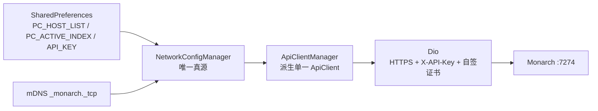

# Torrid Android 架构

## 1. 分层

Torrid 是 Flutter Android-only 应用，入口在 [main.dart](../../android/lib/main.dart)：

```text
main
  ├─ WidgetsFlutterBinding / 竖屏锁定
  ├─ CertTrust.init()                 自签证书信任
  └─ ProviderScope(MyApp)
       ├─ MaterialApp.router
       └─ GoRouter -> features/*/pages
```

目录职责：

| 目录 | 职责 |
| --- | --- |
| `app/` | 应用主题、路由、壳 |
| `core/` | 网络、证书、mDNS、Hive/Prefs、通用模型/组件 |
| `providers/` | Riverpod 级别的网络配置、ApiClient、存储/进度派生 |
| `features/` | 按功能拆分的页面、provider、service、model、widget |

顶层 GoRouter 路由见 [routes.dart](../../android/lib/app/routes/routes.dart)。`/others` 下的漫画、画廊、相册和智能相册是页面内 `Navigator.push` 的二级功能，不要误以为它们都是顶层深链路。

## 2. 网络真源与请求链



- [NetworkConfigManager](../../android/lib/providers/network_config/network_config_provider.dart) 负责多主机、激活项、API key 和 mDNS 发现结果。
- [ApiClientManager](../../android/lib/providers/api_client/api_client_provider.dart) 监听网络配置派生 `ApiClient`；不要在页面中手动推送 ApiClient。
- [ApiClient](../../android/lib/core/services/network/api_client.dart) 统一 Dio、证书、header、GET 重试、二进制和 NDJSON 流。
- fetcher 系列把底层异常记录并转为可读错误；页面不应直接依赖 `DioException`。

服务端 mDNS 只广播 HTTPS 端口；发现后端上保存的 host/port 不会自动切换激活项。

## 3. 本地持久化策略

| 存储 | 内容 | 权威关系 |
| --- | --- | --- |
| SharedPreferences | 主机列表、API key、聊天设置、界面偏好 | Android 本地设置真源 |
| Hive | 随笔/打卡、Chat 会话消息、Review 镜像和历史、漫画缓存 | 依功能决定是本地真源或缓存 |
| sqflite `gallery.db` | Gallery 媒体缓存、下载批次、待写操作 | 仅缓存，不覆盖服务端权威 |
| 文件系统 | 聊天内联图片、下载媒体、临时缓存 | 随业务清理，不能只删数据库记录 |

Hive Adapter 集中在 [hive_service.dart](../../android/lib/core/services/storage/hive_service.dart)。`typeId` 发布后不可复用，新增类型必须查看 [开发备忘](../../开发备忘.md)。

## 4. 功能域与后端映射

| 功能 | 主要目录 | API / 数据策略 |
| --- | --- | --- |
| 积微 | `features/booklet` | `/API/user-data/*`；同步是完整数据集替换 |
| 随笔 | `features/essay` | `/API/user-data/*`；本地派生统计从实际数据重算 |
| 对话 | `features/chat` | `/API/ai/chat` NDJSON；会话/消息只落 Hive |
| 近期回顾 | `features/chat` | 后端计算统计，端上消费 `stats -> delta`；结果只存本机 |
| 漫画 | `features/others/comic` | `/API/comic/*`；服务端库 + 端上阅读/下载缓存 |
| Gallery | `features/others/gallery` | `/API/gallery/*`；写缓冲支持离线，最终回写服务端 |
| Immich 相册 | `features/others/immich` | 在线直达服务端写入，不复用 Gallery 离线缓冲 |
| 智能相册/AI | `features/others/smart_album`、`ai` | `/API/ai/*`；503 时隐藏可选 AI 块或给明确提示 |
| 阅读/RSS | `features/read` | 独立第三方接口，不依赖 Monarch 主数据 |

## 5. 两种容易混淆的写路径

### Gallery 画廊

页面动作进入 `MediaAssetList` 的统一操作入口，执行：

```text
本地内存/SQLite 立即更新
  -> gallery_write_buffer 合并
  -> 后台推送 PATCH/标签 API
  -> 失败退避重试
  -> 最终失败回滚或展示失败状态
```

不要在页面中手写 `updateMediaAsset + queuePatch`，否则容易漏掉内存态同步。

### Immich 相册

该页始终按在线模型走 `retryServerWrite`，失败重试直接针对服务端。它与 Gallery 离线缓冲是有意的不同设计。

## 6. Chat / Review 流式边界

[chat_api_service.dart](../../android/lib/features/chat/services/chat_api_service.dart) 负责逐行拆 NDJSON，`/chat` 与 `/review` 共用解析器：

- `notice`：SnackBar/提示。
- `thinking`：可选思考状态。
- `stats`：Review 的确定性统计。
- `delta`：正文增量。
- `done`：本轮完成。
- `aborted`：模型仲裁抢占，显示“已中断/继续”，不当成普通错误。
- `error`：明确错误。

图片附件采用两条路径：库内媒体只传 `media_id`；手机照片压缩后拷入 `img_storage/chat/`，再以 base64 内联。删除会话必须同时清理附件文件。

## 7. 修改端上接口时的顺序

1. 查看 [API 路由快照](../../backend/references/generated/api/routes.md)，按 handler 定位真实响应。
2. 更新对应 `features/*/services`、model 和 provider。
3. 对 503、空列表、字段缺失、流中断做降级。
4. 如果涉及 Gallery 写入，确认服务端权威和缓存更新顺序没有反转。
5. 运行 `flutter analyze`；生成文件只由 build_runner 生成，不手工编辑 `.g.dart`。
